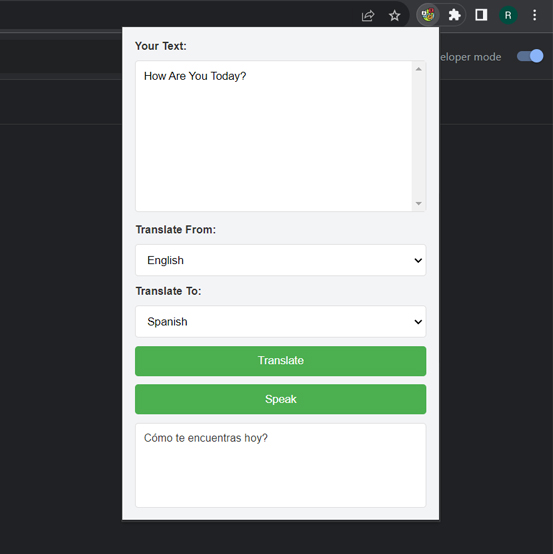

# Translator: A Web-Based Translation Tool

## Overview

**Translator** is a web-based application that allows users to translate text between different languages using a translation API. The tool offers a simple interface for inputting text, selecting target languages, and viewing translations.



## Technologies Used

- **JavaScript**: For handling user interactions and managing API requests.
- **Translation API**: Used to perform the actual text translations.
- **HTML/CSS**: For structuring and styling the user interface.

## Features

- **Text Translation**: Translate text between multiple languages.
- **Language Selection**: Choose from a list of supported languages for translation.
- **User-Friendly Interface**: Simple and intuitive design for easy use.

## Installation

1. Clone this repository:
    ```bash
    git clone https://github.com/vwdr/Translator.git
    ```
2. Open `index.html` in your preferred web browser to start using the translator tool.

## Usage

1. Load `index.html` in your browser to access the translation interface.
2. Enter the text you want to translate into the input field.
3. Select the target language from the dropdown menu.
4. Click the "Translate" button to receive the translated text.

## What I Learned

- **API Integration**: Implemented a translation API to handle text translations.
- **JavaScript Functionality**: Developed functionality for managing user inputs and displaying translations.
- **HTML/CSS Design**: Created a user-friendly interface for inputting text and selecting languages.

## Development

1. **HTML Structure**: Built the basic HTML layout for the translation tool.
2. **CSS Styling**: Designed the interface with CSS for a clean and user-friendly appearance.
3. **JavaScript Implementation**: Integrated the translation API and managed interactions between user input and API responses.

### Challenges

- **API Request Handling**: Managed API requests and responses, including handling errors and ensuring smooth user experience.
- **User Interface**: Designed an intuitive and responsive interface for various devices and screen sizes.
- **Language Support**: Implemented functionality to support multiple languages and handle language-specific nuances.

## Future Improvements

- **Additional Languages**: Expand support to include more languages and dialects.
- **Advanced Features**: Add features like text-to-speech or support for translating multiple texts simultaneously.
- **User Preferences**: Implement settings for saving user preferences and translation history.

## Contributing

Contributions are welcome! Please fork the repository and submit a pull request with your changes. For bug reports or feature requests, open an issue on GitHub.

## License

This project is licensed under the MIT License - see the [LICENSE](LICENSE) file for details.
